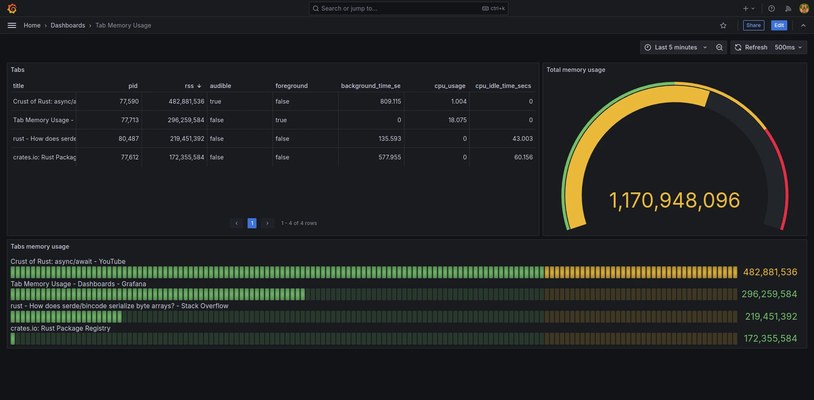

# tab-memory-manager

A memory management strategy more aggressive than Chromium's native memory management mechanism.

Users can configure related options in "~/.config/tab-memory-manager.toml".

By setting these parameters, users can decide how the program handles memory associated with tabs.


## Usage

- Install browser extension "tab-infos"

  The extension only work with Chromium **dev channel** (Need permission `processes` which only on dev channel).

  Manage extension > check Developer mode > Load unpacked > Select tab-infos

- Build and run "tab-memory-manager"

  It listen on "ws://127.0.0.1:60000" for tab information, which should be connect by browser extension.

  ```shell
  cargo run -r
  ```

## Config

Config is "~/.config/tab-memory-manager.toml" on Linux, check [config dir](https://docs.rs/dirs/latest/dirs/fn.config_dir.html).

If it is gone or corrupted, it will be overwrite with default config.

```toml
# Kill the most memory consuming tab in the background with the given strategy
# Options: rss_limit, background_time_limit, cpu_idle_time_limit
kill_tab_strategies = ["rss_limit"]

# Check interval of choosen strategy
# Range: 0.0 ~ inf
check_interval_secs = 1.0

# Don't discard if the tab produce sound recently
whitelist_audible = true

# A list of regex, tab will not be kill if match any
# Example: whitelist: ["https://docs.rs"]
whitelist = []

# Kill the tab if all tabs total resident set size (physical memory usage) hit limit, kill in descending order
[strategy.rss_limit]
# Range: 0 ~ 18_446_744_073_709_551_615
max_bytes = 2_000_000_000

# Kill the tab if it is in background for too long, this will not kill "New Tab"
[strategy.background_time_limit]
# Range: 0.0 ~ inf
max_secs = 3600.0

# Kill the tab if it have not use cpu for too long
[strategy.cpu_idle_time_limit]
# Range: 0.0 ~ inf
max_secs = 3600.0
```

## Grafana dashboard (optional)

The project supports a Grafana visualization dashboard.

View the memory usage of each tab, as shown in the example below.



- Install grafana, grafana plugin and start

  ```
  sudo pacman -S grafana --noconfirm
  sudo grafana cli plugins install marcusolsson-json-datasource
  ```

- Change "/etc/grafana.ini"

  Change (Remember to remove semicolon)

  ```
  ;min_refresh_interval = 5s
  ```
  to

  ```
  min_refresh_interval = 500ms
  ```

- Start grafana

  ```
  sudo systemctl start grafana
  ```

- Open grafana

  Browser open "http://localhost:3000"

- Import dashboard

  Import from "grafana-dashboard.json"

- Add data source (json)

  Set url to "http://127.0.0.1:60001"

